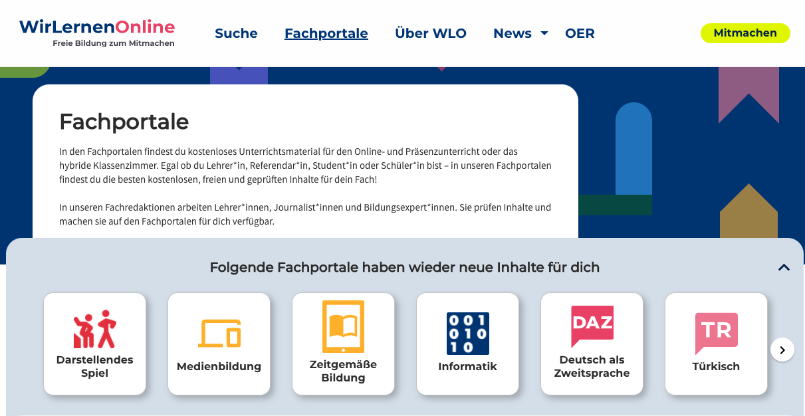
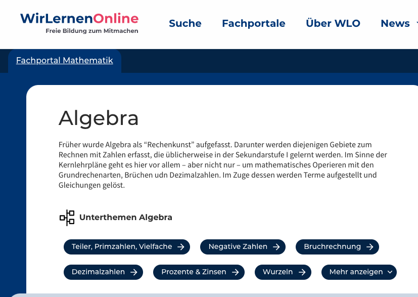
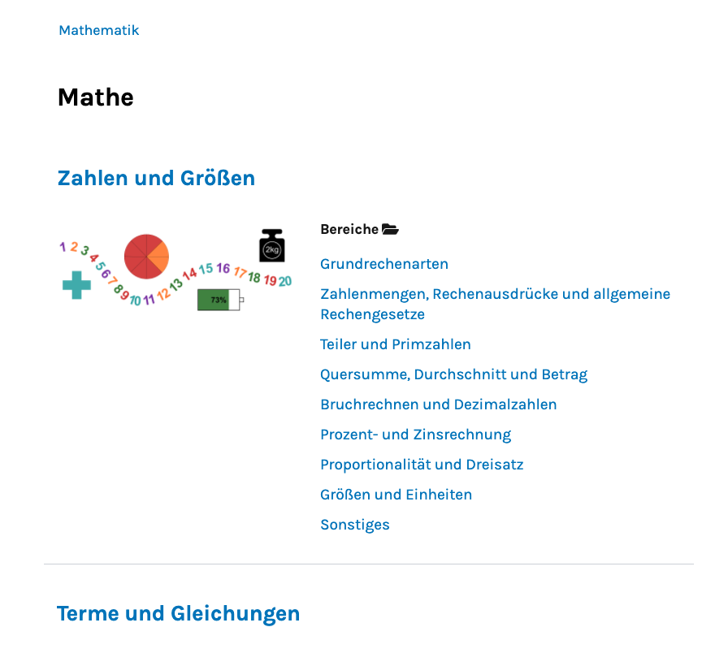
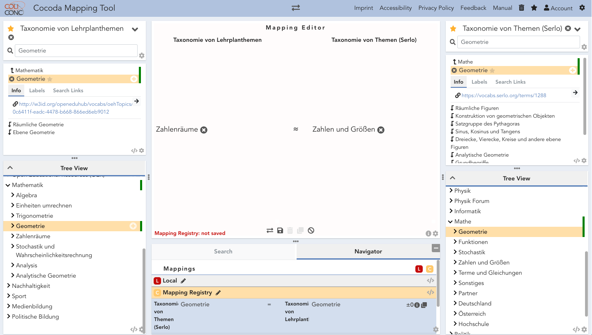

Vom 23.08. bis zum 25.08. fand das diesjährige Jointly-Sommercamp statt.
Neben dem Austausch über aktuelle Entwicklungen, Ideen und Konzepten
stand auch dieses Jahr wieder ein Hackathon auf der Agenda. Besonders im
Fokus stand dabei die Vernetzung von Repositorien. Die GWDG ist im
BMBF-Projekt Jointly unter anderem für die Erarbeitung von Konzepten für
skalierbare und vernetzte IT-Infrastrukturen zuständig.

Ein Team rund um Serlo und WirLernenOnline hat sich in einer von der
GWDG geleiteten Session mit der Frage beschäftigt, wie Metadaten zu
thematischen Einordnungen ausgetauscht werden können, ohne dass dabei
Informationen verloren gehen. Serlo.org wird von dem gemeinnützigen
Verein Serlo Education e.V. betrieben und bietet über 15.000 Aufgaben,
Erklärungen und Lernvideos für Mathematik und andere Schulfächer bereit.
Alle Inhalte werden unter einer freien Lizenz veröffentlicht und dürfen
kopiert, verändert und verbreitet werden.

Sowohl bei WirLernenOnline als auch bei Serlo werden Inhalte in
thematische Strukturen eingeordnet, die sich an Lehrplänen orientieren.
Bei WirLernenOnline geschieht dies in den Fachportalen über die sog.
\"Themenbäume\". Diese Themenbäume wurden von Lehrer\*innen erstellt,
die sich auf WirLernenOnline engagieren und bilden eine übergreifende
Taxonomie des jeweiligen Schulfaches ab. Beim einem Datenaustausch
zwischen den beiden Systemen gehen die Informationen der thematischen
Einordnung bisher verloren, da kein Mapping zwischen den beiden
Themenbäumen besteht. Sinnvoll wäre es jedoch, wenn die thematischen
Einordnungen aufeinander gemappt würden, um Nutzer\*innen in beiden
Systemen diese Einordnung als zusätzliche Information zur Verfügung
stellen zu können.

Fachportale bei WirLernenOnline

Ausschnitt aus der Taxonomie von Lehrplanthemen bei WirLernenOnline

Ausschnitt eines Themenbaums bei Serlo

Modellierung der Themenbäume in SKOS
------------------------------------

Bei WirLernenOnline werden diese Themenbäume in dem RDF-basierten
Standard SKOS[^1] kodiert und anschließend mit Skohub-Vocabs[^2]
veröffentlicht. SKOS (Simple Knowledge Organization System) ist ein
W3C-Standard zur Beschreibung kontrollierter Vokabulare. Der Vorteil der
Beschreibung solcher Vokabulare mit SKOS besteht darin, dass die
Vokabulare einerseits gut maschinenlesbar sind und somit gut in Software
verwendet werden können, andererseits besitzen sie ein hohes Maß an
Nachnutzbarkeit und Interoperabilität. Für eine allgemeine Einführung
SKOS wurde von dem Kompetenzzentrum Interoperable Metadaten (KIM), einer
Gruppe innerhalb der Deutschen Initiative für Netzwerkinformation e.V.
(DINI), eine Einführung für SKOS veröffentlicht.[^3]

Eine weitere Eigenschaft von SKOS besteht darin, dass sich Relationen
zwischen den Begriffen eines Vokabulars ziehen lassen. So können
Relationen einerseits zu Begriffen im selben Vokabular hinterlegt
werden, andererseits auch zu Begriffen in anderen Vokabularen. Zur
Abbildung dieser Relationen stehen verschiedene Attribute zur Verfügung.
Um Relationen innerhalb des eigenen Vokabulars abzubilden, werden meist
`skos:narrower` und `skos:broader` verwendet, um Oberbegriffe und
Unterbegriffe zu unterscheiden. Das Attribut `skos:related` wird
verwendet, um assoziierende Relationen zu einem anderen Begriff
innerhalb desselben Vokabulars auszuzeichnen. Zur Kennzeichnung von
Relationen zu einem anderen Vokabular stehen die Attribute
`skos:broadMatch` und `skos:narrowMatch` zur Verfügung, um Ober- und
Unterbegriffe zu unterscheiden, jedoch innerhalb eines anderen
Vokabulars. Außerdem können `skos:closeMatch`, `skos:exactMatch` und
`skos:relatedmatch` verwendet werden, um die Art der Beziehung zu
Begriffen anderer Vokabulare auszudrücken.

Im Rahmen des Hackathons haben wir uns dazu entschieden, in einem
Proof-of-concept zu testen, ob und wie sich die Beziehungen zwischen dem
Themenbaum von Serlo und dem Themenbaum von WirLernenOnline einfügen
lassen könnten. Dazu musste zunächst der Themenbaum aus Serlo exportiert
und in SKOS abgebildet werden.

Anschließend stellte sich die Frage, wie das Mapping zwischen den beiden
Bäumen hergestellt werden kann. Hierbei gibt es grundsätzlich zwei
Möglichkeiten:

-   Das Mapping direkt in den Turtle-Dateien einpflegen[^4]

-   Das Mapping mit Hilfe eines dedizierten Mapping-Tools durchführen

Das Hinterlegen des Mappings direkt in den Turtle-Dateien ist besonders
bei größeren Mappings aufwändig und fehleranfällig. Außerdem sind
Kenntnisse der Turtle-Syntax notwendig. Auch wenn diese nicht allzu
schwierig zu lernen ist, sollten die inhaltlichen Expert\*innen, die
sich mit solchen Mappings beschäftigen nicht damit beschäftigen müssen,
eine spezielle Syntax zu erlernen, sondern sich auf das Mapping
konzentrieren können. Auch bietet ein dediziertes Mapping-Tool weitere
Vorteile, wie eine visuelle Oberfläche sowie ggf. softwaregestütze
Unterstützung beim Mapping.

Im Rahmen der OER-Metadatengruppe und Curricula-Gruppe wurde dazu
bereits am 17.03.2021 ein gemeinsamer Workshop mit dem coli-conc Team
der Verbundzentrale des GBV durchgeführt. Das coli-conc Projekt hat dazu
das Tool "Cocoda" entwickelt, eine Vue.js Applikation mit der auf einer
ansprechend und übersichtlich gestalteten Oberfläche Mappings zwischen
Vokabularen erarbeitet werden kann.

In dem Workshop wurde bereits anhand zwei unterschiedlicher
Fächerklassifikationen ein solches Mapping ausprobiert und demonstriert.
Cocoda bietet dabei verschiedene Möglichkeiten an, ein Vokabular
einzulesen:

-   Skosmos-API

-   JSKOS-Server[^5]

-   SkoHub (momentan noch in der Test-Phase)

Da wir von der Möglichkeit SkoHub direkt benutzen zu können erst nach
dem Hackathon erfahren haben, haben wir uns für einen eigenen
JSKOS-Server entschieden.

Insgesamt waren für uns also folgende Arbeitsschritte notwendig, um ein
Mapping zwischen zwei Vokabularen in Cocoda durchzuführen:

1.  Bereitstellung des Vokabulars im JSKOS-Format[^6]

2.  Hosting des Vokabulars auf einem JSKOS-Server

3.  Anpassung der Cocoda-Konfiguration

Bereitstellung des Vokabulars im JSKOS-Format
---------------------------------------------

Nachdem das Serlo-Team den Mathe-Themenbaum bereits in SKOS modelliert
hat, musste nun beide Taxonomien in das JSKOS-Format überführt werden.
Dazu gibt es glücklicherweise das Tool skos2jskos, das hierfür genutzt
werden kann. Nach der Installation kann mit einem einfachen
`skos2jskos /``your_skos_file.ttl``/` das entsprechende SKOS-File in das
JSKOS-Format konvertiert werden. Als Ergebnis werden zwei Dateien
generiert: `schema.json` und `concepts.ndjson`. Diese werden im nächsten
Schritt in den JSKOS Server importiert.

Hosting des Vokabulars auf einem JSKOS-Server
---------------------------------------------

Dank guter Dokumentation ist der JSKOS-Server schnell aufgesetzt. Neben
der JSKOS-Instanz selbst ist noch ein Mongo-DB-Server nötig. Dieser wird
entweder ebenfalls schnell selbst installiert oder es kann das ebenfalls
angebotene Docker-Compose-File genutzt werden, das den JSKOS-Container
inklusive eines Mongo-DB-Containers startet.[^7] Anschließend müssen
lediglich mit folgenden Befehlen die schema-Datei und die concepts-Datei
importiert werden.[^8]

    npm run import -- schemes ../data/imports/serlo/scheme.json
    npm run import -- concepts ../data/imports/concepts.ndjson

Wir aktualisieren anschließend noch den Index mit folgendem Befehl:

    npm run import -- --indexes

Anpassung der Cocoda-Konfiguration
----------------------------------

Als letzten Schritt muss nun noch die Konfiguration in Cocoda angepasst
werden, damit die Vokabulare vom JSKOS-Server von Cocoda erkannt werden.
Die Konfiguration ist in der README.md des GitHub-Repositories
dokumentiert.[^9] Mit folgendem JSON-Objekt wurde unsere lokale
JSKOS-Instanz in der Konfigurationsdatei hinzugefügt.

    {
        "provider": "ConceptApi",
        "uri": "http://localhost:3000",
        "status": "http://localhost:3000/status",
        "notation": [
            "WLO"
        ],
        "prefLabel": {
            "en": "WLO JSKOS"
        },
        "definition": {
            "en": [
                "WirLernenOnline JSKOS server instance"
            ],
            "de": [
                "WirLernenOnline JSKOS-Server Instanz"
            ]
        }
    }

Die Mappings selbst können entweder lokal gespeichert werden oder auf
einem JSKOS-Server (oder beides). Hier sind beispielhaft zwei
JSON-Objekte dargestellt, die einmal das lokale Mapping und das
Einbinden einer JSKOS-Instanz für das Mapping zeigen:

-   Lokales Speichern des Mappings:

    {
        "provider": "LocalMappings",
        "uri": "http://coli-conc.gbv.de/registry/local-mappings",
        "notation": [
            "L"
        ],
        "prefLabel": {
            "de": "Lokal",
            "en": "Local"
        },
        "definition": {
            "en": [
                "Mappings saved locally in the browser"
            ],
            "de": [
                "Mappings, die lokal im Browser gespeichert wurden"
            ]
        }
    }

-   Speichern des Mappings auf einer JSKOS-Instanz

    {
        "provider": "MappingsApi",
        "uri": "http://localhost:3000/mappings",
        "status": "http://localhost:3000/status",
        "notation": [
            "C"
        ],
        "prefLabel": {
            "de": "Mapping-Register",
            "en": "Mapping Registry"
        },
        "definition": {
            "en": [
                "Central concordance registry of WirLernenOnline."
            ],
            "de": [
                "Zentrales Konkordanz-Register von WirLernenOnline"
            ]
        }
    }

Auf <https://hub.docker.com/r/coliconc/cocoda> wird beschrieben, wie der
Service mit Docker einfach gestartet werden kann und die eigene
Config-Datei eingebunden wird. Nach einem einfachen
`docker-compose`` ``up` stand der Mapping-Service anschließend zur
Verfügung.

Beispielhaftes Mapping der Konzepte Zahlenräume (WirLernenOnline) auf
Zahlen und Größen (Serlo)

Mapping der Themenbäume
-----------------------

Am Hackathon selbst sind wir nicht mehr dazu gekommen, die Themenbäume
auch tatsächlich aufeinander zu mappen. Jedoch konnten wir zeigen, dass
das Mapping nun auf einfache Weise möglich wäre, ohne dass Kenntnisse
der Turtle-Syntax notwendig sind. In einem Mapping-Sprint könnten sich
Fachredaktionen zusammenschließen und ein Mapping verschiedener
Themenbäume durchführen. Mit leichten Anpassungen in der
Crawling-Infrastruktur wäre es dann möglich, dass beim Crawlen, sofern
als Metadatum bereitgestellt, die Infos über die Themenbaumeinordnung
eines Materials erfasst wird. Aufgrund des Mapping könnte dann die
Einordnung bei Serlo auf die Einordnung bei WirLernenOnline übertragen
werden. Nach dem Crawling würden die neu hinzugekommenen Materialien den
Fachredaktionen als Vorschläge für die Themen in ihren Fachportalen
angezeigt werden. Auf diese Weise wird ihnen das Einsortieren von neuen
Materialien deutlich erleichtert. Die durch das Mapping neu gewonnenen
Informationen können außerdem verwendet werden, um die Machine-Learning
Prozesse in der Redaktionsumgebung von WirLernenOnline zu verbessern.

[^1]: https://www.w3.org/TR/skos-primer/

[^2]: s. https://skohub.io

[^3]: https://dini-ag-kim.github.io/skos-einfuehrung/#/ für eine deutsche Einführung in SKOS

[^4]: Turtle ist ein Serialisierungsformat des RDF-Datenmodells.

[^5]: https://github.com/gbv/jskos-server

[^6]: https://metacpan.org/pod/skos2jskos

[^7]: https://hub.docker.com/r/coliconc/jskos-server

[^8]: https://github.com/gbv/jskos-server\#data-import

[^9]: https://github.com/gbv/cocoda\#configuration
