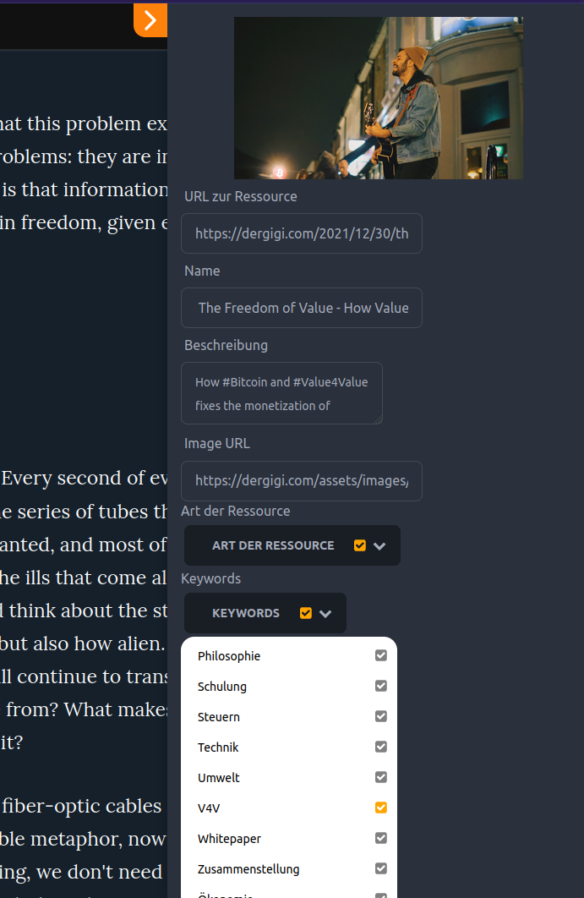

(scroll down for [german-version](#german-version))

As some of you know, I work in the field of Open Education.
I am particularly interested in how communities can collect, annotate, and share educational materials in a decentralized way.
Adrian Pohl and Felix Ostrowki proposed [making vocabularies social actors](https://blog.skohub.io/2020-06-25-skohub-pubsub/) in 2020.
In the [SkoHub](https://skohub.io) project, they have designed and built tools for this purpose that allow controlled vocabularies to be easily published and made social actors based on the [Activity Pub protocol](https://activitypub.rocks/).
This allows the attributes, such as keywords, that I use to mark up a resource to become social actors themselves that I can follow or interact with.

The hackathon [Hack-Nostr-On](https://dorahacks.io/hackathon/hack-nostr-on) inspired me to think this idea further and apply the approach to [Nostr](https://Nostr.com/).
This has now resulted in a prototype, the ["Bitcoin Library"](https://github.com/bitcoin-library).

## Why Nostr?

First of all: I think the ActivityPub approach and the [Fediverse](https://en.wikipedia.org/wiki/Fediverse) are great.
However, I can certainly imagine circumstances in which a censorship-resistant, far more decentralized educational resource network might become important.
Namely, precisely when educational content is not desired by institutional (or even other authoritarian) sources.
In this case, it is much easier to force centralized or even federated networks to cooperate and exclude actors or content from them.
Operating Mastodon or other ActivityPub clients is much more complex than setting up a relay and represents a single point of failure in such a case.
In addition, user accounts are lost when closing an ActivityPub instance, a subsequent migration is (to my knowledge) not possible, also all follower information is lost.
This can't happen with Nostr by design, because all actors have a private key with which they can sign messages and send them to arbitrary relays.
Even if relays are closed or certain users are excluded, the messages can simply be sent to and obtained from any other relays (as long as they were previously sent or mirrored there).

## How to transfer to Nostr?

A transfer of the concept developed in SkoHub should be possible in a simple way.
At this point, a short digression for those who have nothing to do with controlled vocabularies ([SKOS (german introduction)](https://dini-ag-kim.github.io/skos-einfuehrung/#/)).

### What are controlled vocabularies?

Controlled vocabularies are, simply put, nothing more than fixed lists of values.
Any drop-down menu can also be called a controlled vocabulary.
Now the innovative approach in SKOS, the Simple Knowledge Organization System, is that these vocabularies and their entries are tagged with a URL and can also be tagged with other metadata, such as relationships to build hierarchies, alternate labels, and other things.
This makes it possible for the entry from a controlled vocabulary, to get its own "web page".
For this purpose, for example, [SkoHub Vocabs](https://github.com/skohub-io/skohub-vocabs) was developed.
With the help of this tool, controlled vocabularies can be easily published on the web and get a URI that helps to interact with them.

As an example, here is a vocabulary of subject groups and study areas in the field of higher education: https://w3id.org/kim/hochschulfaechersystematik/scheme.

Now it gets particularly exciting because instead of the HTML page, I can also call a JSON representation of the data at the same link: https://w3id.org/kim/hochschulfaechersystematik/scheme.json (or via content-negotiation).
This allows machines to easily interact with these vocabularies by reading information stored there.

### How does this help when building a decentralized library on Nostr?

Dropdown menus, for example, can now be implemented in such a way that the data about possible values no longer has to be stored in the program code, but is fetched from the application via a URI of the vocabulary.
This facilitates the separation of data and code.
However, additional metadata about the controlled vocabularies can also be made available in this way, for example, a Nostr Public Key, next to the inbox of Activity Pub, making the entry in this controlled vocabulary itself an actor.
Applications can then use this public key to interact with this entry.
For example, they can send and share resources with this actor in the form of links.
People, in turn, can also follow these entries on Nostr and be notified when this actor writes new notes and shares links to resources.

This allows communities to form and organize, linking topic-based resources to such vocabulary entries, creating a knowledge graph that can in turn be used by other applications, such as a "library", to build a search engine over these community-annotated resources.

## Too much theory, show me something!

The prototype consists of three components:

- Metadata Editor (as a browser extension).
- Note-Fetcher
- Frontend

### The metadata editor

As a first prototype and PoC, I reused something that was already developed at SkoHub, but unfortunately has since been shut down due to lack of resources: A browser extension that allows you to annotate the web page with metadata, which subsequently shares the resource as actors on Nostr.



Here, for example, I annotated [Gigi's great Value4Value](https://dergigi.com/2021/12/30/the-freedom-of-value/) article with the tool (available metadata, such as image, title, description and URL are automatically taken from the web page) and still annotated it with the metadata "article" as well as "V4V" (the entries come partly from the [Twenty-One Library](https://portal.einundzwanzig.space/de/library/library-item?l=de)).

After clicking "Publish" the metadata of the resource is shared as "Notes" by the bots on Nostr.
The metadata about the resource is stored in a tag `metadata` and can be used from there by other services.
For example, an event looks like this:

```json
[
  "EVENT",
  "0",
  {
    "id": "bd000c944f40667b9cfc7f1d99e60f456de6f797aa39ebeb12113cac93cbb98c",
    "kind": 1,
    "pubkey": "8af30833be407219d6a2d2a6a84d2cea7d3c212693090fcc2b110ca944c3a617",
    "created_at": 1682689537,
    "content": "Hello! A new resource with title \"Bitcoin Flyer in Swahili\" got added to the library!\n    https://blotcdn.com/blog_378314d0a9ec45bfa46b3bc7d3718410/_thumbnails/b0cefa01-8abe-42ed-89fe-d6a1e79b6e11/large.png\nAround 200 million people are speaking Swahili. Now they can learn and share the basics about Bitcoin with BFF's Bitcoin flyer..\nSent from Nostr:npub1j8wdpuqqct23l4gyyxa5dkjvgkxzkjh3n3mzzjj79uhcvh424pcqurytqu (Bitcoin Library).\n    ",
    "tags": [
      [
        "p",
        "8af30833be407219d6a2d2a6a84d2cea7d3c212693090fcc2b110ca944c3a617"
      ],
      [
        "metadata",
        "{\"id\":\"https://anitaposch.com/bitcoin-swahili\",\"name\":\"Bitcoin Flyer in Swahili\",\"description\":\"Around 200 million people are speaking Swahili. Now they can learn and share the basics about Bitcoin with BFF's Bitcoin flyer.\",\"image\":\"https://blotcdn.com/blog_378314d0a9ec45bfa46b3bc7d3718410/_thumbnails/b0cefa01-8abe-42ed-89fe-d6a1e79b6e11/large.png\",\"resourceType\":[{\"id\":0,\"checked\":true,\"title\":\"Artikel\",\"uri\":\"https://w3id.org/bitcoin-library/bots/f631971e-ee83-4c95-9fcf-b1c1639bb4f6\"}],\"keywords\":[{\"id\":1,\"title\":\"Allgemein Bitcoin\",\"uri\":\"https://w3id.org/bitcoin-library/bots/4e42c22d-0b45-4d8a-bb49-6d95d56e2558\",\"checked\":true}],\"authors\":[{\"name\":\"Anita Posch\",\"npub\":\"npub1tjkc9jycaenqzdc3j3wkslmaj4ylv3dqzxzx0khz7h38f3vc6mls4ys9w3\",\"id\":\"4EEmDu8x\"}],\"metadataContributor\":{\"name\":\"\",\"npub\":\"\"}}"
      ]
    ],
    "sig": "b07b2db792ff8c90526e93695dbad1d030a45e4b3e4b64138d0a0aa24d53d5405bcca4a6d4c2231c2eae9b267a0366473c2d0eba63309c259adc7eb2b0a59190"
  }
]
```

In the future, it should also be possible to send interesting notes directly to the bots, so that not only web resources, but also notes can be made findable in the search index.

### The Note Fetcher

The "Note Fetcher" is, in a sense, the heart of the entire service, in that the classic ETL (Extract, Transform, Load) takes place there.
Every five seconds, the "Note Fetcher" checks whether there are any new events.
If there is a new event, it first checks whether the resource already exists in the search index.
The URL is decisive and serves as the identifier of the resource.
If the resource is not yet in the index, it is added there.

However, if the resource already exists, the metadata is merged.
This merging of metadata is an elementary part of the entire decentralized annotation concept.
In a decentralized community-based approach, actors will inevitably annotate the same resources with different metadata sooner or later.
For example, one assigns the resource to the "environment" topic, while another assigns it to the "mining" topic. A third may assign both attributes and still a third.

In the long run, I assume that the attributes that fit best will be assigned most often, and thus a kind of "consensus" will emerge. 
More on this in the next section.

The tagged metadata is then written to the search index and is then available in the search frontend.

### The frontend - The Bitcoin Library

The frontend is a simple web application that queries, displays, makes searchable and filterable the metadata from the search index.


To visualize the tagged metadata, the tags are displayed with different "opacity".
The less often a metadata has been tagged, the paler it is displayed.
This is to make clear how often the metadatum was assigned.


### Value For Value

Content creators, especially for educational materials, provide an invaluable service to society by making their materials available on the web.
They often do so using [Creative Commons licenses](https://creativecommons.org/licenses/?lang=en), which allow others to use and remix the materials.
This makes it easy to adapt and reuse the materials in a legally secure way.

However, previous centralized platforms or even ActivityPub based networks such as Mastodon do not offer a way to give anything back to creators other than a "like".
Nostr, through its proximity to the Bitcoin and Lightning networks, offers a solution to give something back directly to creators without intermediaries.

But also those who provide the metadata can specify your Npub in the metadata editor.
From there, as with content creators, if available, the [LUD16](https://github.com/lnurl/luds/blob/luds/16.md) address is retrieved from the profile.
This address can then be used to make a small donation with Alby (so it is not (yet) an implementation of [NIP-57](https://github.com/Nostr-protocol/nips/blob/master/57.md)).


## Outlook - No Data in the Code

The metadata editor has been developed based on JSON Schema.
The values in the dropdown menus are SKOS vocabularies.
This should (in the future) make it possible to easily develop other JSON schemas and use other vocabularies.

Why not build a community based collection for recipes in the future?
Only the metadata and new vocabularies need to be developed.
Many components of Note Fetcher or Bitcoin Library can be reused.

## Conclusion

I published the code on GitHub in the [organization "Bitcoin Library"](https://github.com/bitcoin-library).
The repos are probably not very helpful at the moment and the code is not very pretty either.
In the next few weeks I hope to first deploy the service once and then refactor and document the code.

I appreciate any feedback, questions and suggestions. And of course especially if someone wants to contribute.

## Links

- [SkoHub PubSub](https://blog.skohub.io/2020-06-25-skohub-pubsub/)
- [Activity Pub](https://activitypub.rocks/)
- [Einführung in SKOS](https://dini-ag-kim.github.io/skos-einfuehrung/#/)
- [RDF](https://en.wikipedia.org/wiki/Resource_Description_Framework)
- [Einundzwanzig Bibliothek](https://portal.einundzwanzig.space/de/library/library-item?l=de)
- [Hack-Nostr-On](https://dorahacks.io/hackathon/hack-nostr-on)
- [Nostr](https://nostr.com/)


# German version

Wie manche von euch wissen, arbeite ich im Bereich Open Education.
Dabei treibt mich besonders das Interesse, wie Communities dezentral Bildungsmaterialien sammeln, annotieren und für andere zugänglich machen können.
Adrian Pohl und Felix Ostrowki haben dazu 2020 den Vorschlag gemacht, [Vokabulare zu sozialen Akteuren zu machen](https://blog.skohub.io/2020-06-25-skohub-pubsub/).
Im [SkoHub](https://skohub.io)-Projekt haben sie dazu Tools entworfen und gebaut, die es ermöglichen kontrollierte Vokabulare auf einfache Art und Weise zu veröffentlichen und zu sozialen Akteuren auf Basis des [Activity Pub Protokolls](https://activitypub.rocks/) zu machen.
Damit können die Attribute, wie beispielsweise Schlagworte (keywords), mit denen ich eine Ressource auszeichne, selbst zu sozialen Akteuren werden, denen ich folgen oder mit denen interagieren kann.

Der Hackathon [Hack-Nostr-On](https://dorahacks.io/hackathon/hack-nostr-on) hat mich dazu inspiriert, diese Idee weiterzudenken und den Ansatz auf [Nostr](https://Nostr.com/) zu übertragen.
Dabei ist nun als Prototyp, die ["Bitcoin-Library"](https://github.com/bitcoin-library) entstanden.

## Warum Nostr?

Zunächst mal: Ich halte den ActivityPub Ansatz und das [Fediverse](https://en.wikipedia.org/wiki/Fediverse) für großartig.
Jedoch kann ich mir durchaus Umstände vorstellen, in denen ein zensurresistentes, weitaus dezentraler gestaltetes Netzwerk für Bildungsressourcen wichtig werden kann.
Nämlich genau dann, wenn die Bildungsinhalte von institutioneller (oder auch anderer autoritärer) Seite nicht gewünscht sind.
In diesem Fall ist es wesentlich einfacher zentrale oder auch föderierte Netzwerke zur Kooperation zu zwingen und Akteure oder Inhalte von ihnen auszuschließen.
Der Betrieb von Mastodon oder anderen ActivityPub-Klienten ist wesentlich aufwändiger als das Aufsetzen eines Relays und stellt in so einem Fall einen Single Point of Failure dar.
Außerdem gehen die User Accounts beim Schließen einer ActivityPub Instanz verloren, eine nachträgliche Migration ist (meines Wissens nach) nicht möglich, auch alle Follower-Information gehen verloren.
Dies kann bei Nostr per Design nicht passieren, da alle Akteure einen privaten Schlüssel besitzen, mit dem sie die Nachrichten signieren und an beliebige Relays schicken können.
Selbst wenn Relays geschlossen oder bestimmte User ausgeschlossen werden, können die Nachrichten einfach an beliebige andere Relays gesendet und von dort bezogen werden (sofern sie vorher dorthin gesendet oder gespieglt wurden).

## Wie auf Nostr übertragen?

Eine Übertragung des in SkoHub entwickelten Konzeptes sollte auf einfach Weise möglich sein.
An dieser Stelle ein kurzer Exkurs für alle, die mit kontrollierten Vokabularen ([SKOS](https://dini-ag-kim.github.io/skos-einfuehrung/#/)) sonst nichts am Hut haben.

### Was sind kontrollierte Vokabulare?

Kontrollierte Vokabulare sind schlicht gesagt, nichts anderes als feste Wertelisten.
Jedes Dropdown-Menü kann auch als kontrolliertes Vokabular bezeichnet werden.
Der innovative Ansatz bei SKOS, dem Simple Knowledge Organization System, ist nun, dass diese Vokabulare und ihre Einträge mit einer URL versehen werden und auch mit anderen Metadaten, wie Beziehungen, um beispielsweise Hierarchien aufzubauen, Alternativbezeichnungen und anderen Dingen ausgezeichnet werden können.
Dies macht es möglich, dass der Eintrag aus einem kontrollierten Vokabular, eine eigene "Webseite" bekommen kann.
Für diesen Zweck wurde beispielsweise [SkoHub Vocabs](https://github.com/skohub-io/skohub-vocabs) entwickelt.
Mit Hilfe dieses Tools können kontrollierte Vokabulare einfach im Web veröffentlicht werden und bekommen eine URI, die dabei hilft mit ihnen zu interagieren.

Hier als Beispiel eine Hochschulfächersystematik: https://w3id.org/kim/hochschulfaechersystematik/scheme

Besonders spannend wird es nun, weil ich statt der HTML-Seite unter dem gleichen Link auch eine JSON-Repräsentation der Daten aufrufen kann: https://w3id.org/kim/hochschulfaechersystematik/scheme.json (oder über Content-Negotiation)
Dies ermöglicht es, dass Maschinen auf einfache Art und Weise mit diesen Vokabularen interagieren können, indem sie dort hinterlegten Informationen auslesen.

### Wie hilft das beim Aufbau einer dezentralen Bibliothek auf Nostr?

Dropdown Menüs können beispielsweise nun so realisiert werden, dass die Daten über mögliche Werte nicht mehr im Programmcode gespeichert werden müssen, sondern über eine URI von der Applikation geholt werden.
Das erleichtert die Trennung von Daten und Code.
Allerdings können auch weitere Metadaten zu den kontrollierten Vokabularen so zur Verfügung gestellt werden, beispielsweise ein Nostr Public Key, neben der Inbox von Activity Pub, womit der Eintrag in diesem kontrollierten Vokabular selbst zum Akteur wird.
Diesen Public Key können dann Applikationen nutzen, um mit diesem Eintrag zu interagieren.
Sie können beispielsweise Ressourcen in Form von Links an diesen Akteur senden und mit ihm teilen.
Menschen wiederum können ebenfalls diesen Einträgen auf Nostr folgen und werden benachrichtigt, wenn dieser Akteur neue Notes verfasst und Links zu Ressourcen teilt.

Damit können sich Communities bilden und organisieren, die themenbezogen Ressourcen mit solchen Vokabulareinträgen verlinken, wodurch ein Wissensgraph entsteht, der wiederum von anderen Applikationen, beispielsweise einer "Bibliothek" genutzt werden kann, um eine Suchmaschine über diese community-annotierten Ressourcen aufzubauen.

## Zu viel Theorie, zeig mir was!

Der Prototyp besteht aus drei Komponenten:

- Metadaten-Editor (als Browser Extension)
- Note-Fetcher
- Frontend

### Der Metadaten-Editor

Als ersten Prototyp und PoC habe ich etwas nachgenutzt, das bereits bei SkoHub entwickelt wurde, jedoch mittlerweile leider aus Mangel an Ressourcen abgeschaltet wurde: Eine Browser Extension, die es ermöglicht, die Webseite mit Metadaten zu annotieren, die anschließend als Akteure die Ressource auf Nostr teilen.


Hier habe ich beispielsweise [Gigis großartigen Value4Value](https://dergigi.com/2021/12/30/the-freedom-of-value/) Artikel mit dem Tool annotiert (verfügbare Metadaten, wie Bild, Titel, Beschreibung und URL werden automatisch von der Webseite übernommen) und noch mit den Metadaten "Artikel" sowie "V4V" versehen (die Einträge kommen teilweise von der [Einundzwanzig Bibliothek](https://portal.einundzwanzig.space/de/library/library-item?l=de)).

Nach einem Klick auf "Publish" werden die Metadaten der Ressource als "Notes" durch die Bots auf Nostr geteilt.
Die Metadaten zur Resource werden in einem Tag `metadata` gespeichert und können von dort aus von anderen Services genutzt werden.
Ein Event sieht dabei beispielsweise so aus: 

```json
[
  "EVENT",
  "0",
  {
    "id": "bd000c944f40667b9cfc7f1d99e60f456de6f797aa39ebeb12113cac93cbb98c",
    "kind": 1,
    "pubkey": "8af30833be407219d6a2d2a6a84d2cea7d3c212693090fcc2b110ca944c3a617",
    "created_at": 1682689537,
    "content": "Hello! A new resource with title \"Bitcoin Flyer in Swahili\" got added to the library!\n    https://blotcdn.com/blog_378314d0a9ec45bfa46b3bc7d3718410/_thumbnails/b0cefa01-8abe-42ed-89fe-d6a1e79b6e11/large.png\nAround 200 million people are speaking Swahili. Now they can learn and share the basics about Bitcoin with BFF's Bitcoin flyer..\nSent from Nostr:npub1j8wdpuqqct23l4gyyxa5dkjvgkxzkjh3n3mzzjj79uhcvh424pcqurytqu (Bitcoin Library).\n    ",
    "tags": [
      [
        "p",
        "8af30833be407219d6a2d2a6a84d2cea7d3c212693090fcc2b110ca944c3a617"
      ],
      [
        "metadata",
        "{\"id\":\"https://anitaposch.com/bitcoin-swahili\",\"name\":\"Bitcoin Flyer in Swahili\",\"description\":\"Around 200 million people are speaking Swahili. Now they can learn and share the basics about Bitcoin with BFF's Bitcoin flyer.\",\"image\":\"https://blotcdn.com/blog_378314d0a9ec45bfa46b3bc7d3718410/_thumbnails/b0cefa01-8abe-42ed-89fe-d6a1e79b6e11/large.png\",\"resourceType\":[{\"id\":0,\"checked\":true,\"title\":\"Artikel\",\"uri\":\"https://w3id.org/bitcoin-library/bots/f631971e-ee83-4c95-9fcf-b1c1639bb4f6\"}],\"keywords\":[{\"id\":1,\"title\":\"Allgemein Bitcoin\",\"uri\":\"https://w3id.org/bitcoin-library/bots/4e42c22d-0b45-4d8a-bb49-6d95d56e2558\",\"checked\":true}],\"authors\":[{\"name\":\"Anita Posch\",\"npub\":\"npub1tjkc9jycaenqzdc3j3wkslmaj4ylv3dqzxzx0khz7h38f3vc6mls4ys9w3\",\"id\":\"4EEmDu8x\"}],\"metadataContributor\":{\"name\":\"\",\"npub\":\"\"}}"
      ]
    ],
    "sig": "b07b2db792ff8c90526e93695dbad1d030a45e4b3e4b64138d0a0aa24d53d5405bcca4a6d4c2231c2eae9b267a0366473c2d0eba63309c259adc7eb2b0a59190"
  }
]
```

Zukünftig soll es auch möglich werden, interessante Notes direkt an die Bots zu senden, sodass nicht nur Webressourcen, sondern auch Notes in dem Suchindex auffindbar gemacht werden können.

### Der Note Fetcher

Der "Note Fetcher" ist gewissermaßen ein Herzstück des gesamten Services, indem dort das klassische ETL (Extract, Transform, Load) stattfindet.
Alle fünf Sekunden prüft der "Note Fetcher", ob es neue Events gibt.
Falls ein neues Event vorhanden ist, wird zunächst geprüft, ob die Ressource bereits im Suchindex vorhanden ist.
Dabei ist die URL maßgebend und dient als Identifier der Ressource.
Falls die Resource noch nicht im Index vorhanden ist, wird sie dort hinzugefügt.

Falls die Ressource jedoch bereits vorhanden ist, werden die Metadaten gemergt.
Dieses Merging der Metadaten stellt einen elementaren Bestandteil des gesamten dezentralen Annotationskonzeptes dar.
In einem dezentral community basierten Ansatz werden zwangsläufig Akteure dieselben Ressourcen früher oder später mit unterschiedlichen Metadaten annotieren.
Der eine ordnet die Ressource beispielsweise dem Thema "Umwelt" zu, die andere dem Thema "Mining". Eine dritte vergibt vielleicht beide Attribute und noch ein Drittes.

Langfristig gehe ich davon aus, dass die Attribute, die am besten passen, am häufigsten vergeben werden und sich so eine Art "Konsens" herausbildet. 
Mehr dazu im nächsten Abschnitt.

Die gemergten Metadaten werden anschließend in den Suchindex geschrieben und sind anschließend im Suchfrontend verfügbar.

### Das Frontend - Die Bitcoin Library

Das Frontend ist eine einfache Webanwendung, die die Metadaten aus dem Suchindex abfragt, anzeigt, such- und filterbar macht.


Um die gemergten Metadaten zu visualisieren, werden die Tags mit unterschiedlicher "Opacity" dargestellt.
Je seltener ein Metadatum vergeben wurde, desto blasser wird es dargestellt.
Damit soll verdeutlicht werden, wie oft das Metadatum vergeben wurde.


### Value For Value

Content Ersteller, besonders für Bildungsmaterialien, erweisen der Gesellschaft einen unschätzbaren Dienst, indem sie ihre Materialien im Web bereit stellen.
Häufig werden dabei auch [Creative Commons Lizenzen](https://creativecommons.org/licenses/?lang=en) verwendet, die es anderen erlauben, die Materialien zu verwenden und zu remixen.
Damit können die Materialien einfach und rechtssicher angepasst und weiterverwendet werden.

Bisherige zentralisierte Plattformen oder auch ActivityPub basierte Netzwerke wie Mastodon bieten jedoch keine Möglichkeit, den Erstellern etwas außer einem "Like" zurückzugeben.
Nostr bietet durch seine Nähe zum Bitcoin und Lightning Netzwerk eine Lösung an, um ohne Intermediäre direkt den Erstellerinnen etwas zurückzugeben.

Aber auch diejenigen, die die Metadaten bereitstellen, können im Metadaten-Editor Ihren Npub angeben.
Von dort wird, wie bei den Content Erstellern, sofern vorhanden, die [LUD16](https://github.com/lnurl/luds/blob/luds/16.md) Adresse aus dem Profil abgefragt.
Diese Adresse kann anschließend genutzt werden, um mit Alby eine kleine Spende zu tätigen (es ist also (noch) keine Implementierung von [NIP-57](https://github.com/Nostr-protocol/nips/blob/master/57.md)).


## Ausblick - No Data in the Code

Der Metadaten-Editor ist auf Basis von JSON Schema entwickelt worden.
Die Werte in den Dropdown-Menüs sind SKOS-Vokabulare.
Damit soll es (zukünftig) möglich werden auf einfache Weise andere JSON Schemata zu entwickeln und andere Vokabulare zu verwenden.

Warum nicht zukünftig eine community basierte Sammlung für Rezepte aufbauen?
Es müssen lediglich die Metadaten sowie neue Vokabulare entwickelt werden.
Viele Komponenten des Note Fetcher oder der Bitcoin Library können wiederverwendet werden.

## Fazit

Den Code habe ich auf GitHub in der [Organisation "Bitcoin Library"](https://github.com/bitcoin-library) veröffentlicht.
Die Repos sind vermutlich momentan noch wenig hilfreich und der Code auch nicht besonders hübsch.
In den nächsten Wochen hoffe ich zunächst den Service einmal zu deployen und anschließend den Code zu refactoren und zu dokumentieren.

Ich freue mich über jedes Feedback, Fragen und Anregungen. Und natürlich besonders, falls jemand mitarbeiten möchte.

## Links

- [SkoHub PubSub](https://blog.skohub.io/2020-06-25-skohub-pubsub/)
- [Activity Pub](https://activitypub.rocks/)
- [Einführung in SKOS](https://dini-ag-kim.github.io/skos-einfuehrung/#/)
- [RDF](https://en.wikipedia.org/wiki/Resource_Description_Framework)
- [Einundzwanzig Bibliothek](https://portal.einundzwanzig.space/de/library/library-item?l=de)
- [Hack-Nostr-On](https://dorahacks.io/hackathon/hack-nostr-on)
- [Nostr](https://nostr.com/)


