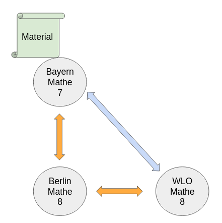

*Scroll down for [german version](#german-version)*

How can the curricula of the states of Germany be linked? And why is this necessary at all? In the workshop "[Linked Curricula](https://docs.google.com/presentation/d/1TLzJLieeN273sdlJ_da5FwdVP12ZhPDV742oZDHbTzo/edit#slide=id.p)" we addressed these questions at this year's OER and IT Summer Camp in Weimar.

## Starting point

Curricula form the basis of teachers' work and define which learning goals and competencies students must achieve at certain points in time. Teachers are therefore very familiar with their own curricula and like to assign their materials directly to specific topics in their curriculum. They also want to be able to search directly in their own subject curriculum. When providing general services, such as WirLernenOnline does, the challenge is therefore how to deal with the 16 different curricula of the states in order to provide appropriate services.

> Hypothesis: There are overlaps in content between the different curricula of the countries.  

In addition to the challenge that no state currently publishes its curricula in a machine-readable form, another challenge lies in linking the curricula topics to one another. In the "[Curricula Group](https://wiki.dnb.de/display/DINIAGKIM/Curricula-Gruppe)" of the DINI-AG-KIM, concepts were therefore developed together with the Institute for Quality Development in Education (IQB), the Media Institute of the Federal States (FWU), Serlo, and representatives of various states to make such a link possible. On the content level, the hypothesis is that there is overlap between the curricula of the states and that similar and identical content is taught in different states. Therefore it is possible to draw relationships between the curricula of the states. To map these relationships technologically, a model has been developed in several [working sessions of the Curricula Group](https://docs.google.com/presentation/d/1Q-dWzffq_J7loIPw2eydBfZhJPZ0Fdm855ZF3Sg1H6o/edit?usp=sharing) and is now available in a [first draft](https://dini-ag-kim.github.io/modell_lehrplaene/draft/). Technologically, the model is based on RDF and therefore allows easy linking of different resources. RDF is now also used as a base technology in several large EU projects such as ESCO or the [Europass Learning Model v3](https://github.com/european-commission-empl/European-Learning-Model/tree/ELM-v3).
The Learning Resource Metadata Initiative (LRMI) also uses RDF as its basic data model, as does the derived ["General Metadata Profile for Educational Resources" (AMB)](https://dini-ag-kim.github.io/amb/draft/). Linking resources and curricula is thus very easy and at the same time the query language SPARQL can be used for both models.

## Aim of the workshop

In the context of the workshop the following scenario should be prototypically implemented: A teacher assigns a material to "**Topic A**" in the Bavarian curriculum. Now "**Topic A" from Bavaria** is linked to "**Topic B" from Berlin**. Furthermore, "**Topic C**" of the WLO topic tree is linked to "**Topic B**" from Berlin. It is assumed that the relationship of the topics matches the definition of `skos:exactMatch`. That is, the topics are exactly the same, in the sense that they can be easily exchanged for each other.
Now a learning material **subject A** from Bavaria is assigned. The material, which has only been assigned to the Bavarian curriculum topic, should then also become findable when searching in the WLO topic tree or the Berlin curriculum.
This reflects the situation where there is an overarching service that wants to make learning materials findable and at the same time allows searching or navigating across curricula.

## Mapping the curricula with Cocoda

To accomplish this, machine-readable representations of the curricula were first to be created. These could either be crawled or converted from other data formats into the "curricula group" model. Since curricula are not published in machine-readable formats, this process is very tedious. In some cases, only relevant parts of a curriculum were captured to serve the workshop use case.
The data was then loaded into the mapping tool "[Cocoda](https://coli-conc.gbv.de/cocoda/)". Cocoda is a tool from the library field and allows to create and manage mappings between knowledge organization systems such as classifications, standards files and thesauri in the form of a web application (see also [article from last summercamp](../2021-08-01/).
  
  

## Reasoning in the mapped curricula

A service was then developed in the hackathon that loads the mappings from Cocoda (more precisely from the connected [JSKOS server](https://github.com/gbv/jskos-server)) into a triple store ([Apache Jena TDB](https://jena.apache.org/documentation/tdb/index.html) + [Fuseki](https://jena.apache.org/documentation/fuseki2/)). RDF technology enables so-called "reasoning", i.e. relationships between objects can be concluded even if they have not been explicitly defined.
This is possible because `skos:exactMatch` [by definition](https://www.w3.org/TR/skos-reference/#L4186) is both symmetric and transitive. But what do symmetry and transitivity mean? A relation is symmetric if it is true in one direction as well as in the other: if A -> B, then also B -> A. An example: If A is related to B, then B is also related to A.

A relation is transitive if the relation A -> B and B -> C implies that A -> C. So, applied to our relationship example, this means:

Applied to the above example, we can thus conclude the following relationship between the curricula (orange are the symmetrical relationships, blue the closed relationship):

Accordingly, the reasoner infers from the relationships of the topics between Bavaria and Berlin and Berlin and WLO that there is also a relationship between the topic in Bavaria and WLO (marked here in blue). In the hackathon, an interface was now developed that accepts IDs to the curricula, searches for relationships in the triple store, and returns the matching IDs. This makes it possible to obtain the respective relationships between the curricula/topic trees.
Now that the appropriate infrastructure had been created to establish the curricula relationships, the process of assigning materials to a topic tree could begin. Here, a function was first implemented in edu-sharing as part of the hackathon that allows multiple SKOS value ranges to be assigned to an attribute. So it was now possible to map multiple prototypical curricula (or even other SKOS value areas) in one field and select them there.

<!-- Insert TODO screenshot of how multiple curricula can be mapped in edu-sharing -->

Next, the above service was added to the metadata dialog of the edu-sharing repository. When saving the metadata, the IDs of the selected curricula were now sent to the reasoning service. The reported back the matching IDs from the other curricula and these were then saved in the metadata record of the material.
Another way to get the same effect would be to resolve the "closed" IDs at runtime. This would have the advantage that changes in the relationships would also be taken into account, for example if another "match" was added or removed in between. In the context of the Hackathon this would have been connected however with higher implementation expenditure.

> The resolution of the "matches", i.e. the reasoning can be done either at runtime or when saving the data set. The resolution at runtime has to be considered accordingly in terms of UI/UX, as this can cost time. Saving the closed matches, on the other hand, has the consequence that the actuality of the matches can be wrong. This could be remedied by a cron job running in the background that regularly checks the matches.  

After integrating the service into the metadata dialog of the edu-sharing repository, it was now possible to additionally store further matching curriculum topics in other curricula after selecting a curriculum topic. As a result, a search in a curriculum now also finds and displays material that was not originally assigned to this topic, but to another topic.

<!-- Insert TODO screenshot of a match -->

## PoC successful

The PoC has thus been successful. The workshop generated many interesting discussion topics that now need to be addressed:

- Who can do an appropriate mapping?
- How do we get the countries' curricula in a machine-readable format?
- What UX concepts are needed if an appropriate service is set up?
- How to deal with topics that do not have a one hundred percent overlap in the curricula, but only partially overlap? What kind of relationship should be indicated here and may further relationships be inferred from this?

Further research and development work is necessary to answer these questions. Overall, however, the current developments at the European and international level show a tendency to develop standards based on RDF. Also on the national level, the IQB educational standards will soon be [published in SKOS](https://github.com/iqb-vocabs). This circumstance is due to the knowledge transfer of the OER metadata group as well as the curricula group of DINI-AG-KIM.
Internationally, ["Wikimedia Education"](https://www.wikidata.org/wiki/Wikidata:Wikidata_for_Education) is addressing the issue of mapping curricula using RDF models.

The approach planned in the PoC is in principle transferable to other models and standards as long as the data is mapped in an RDF-compliant way. In addition, the question of whether there will be a central topic / competence tree on which the countries can agree for mapping ("star approach") or whether there could rather be mapping between the countries ("federation approach") is particularly exciting. In general, the question of who can carry out such a mapping needs to be addressed. However, in order to provide cross-cutting educational services, it will be necessary to pursue these approaches further to provide users with better search and navigation experiences.

## German version

## RDF-Reasoning und vernetzte Lehrpläne

Wie können die Curricula der Länder miteinander vernetzt werden? Und warum ist das überhaupt notwendig? Im Workshop “[Vernetzte Curricula](https://docs.google.com/presentation/d/1TLzJLieeN273sdlJ_da5FwdVP12ZhPDV742oZDHbTzo/edit#slide=id.p)” haben wir uns auf dem diesjährigen OER- und IT-Sommercamp in Weimar diesen Fragestellungen gewidmet.
(Hinweis: Die Begriffe "Lehrplan" und "Curriculum" werden in diesem Artikel synonym verwendet)

## Ausgangslage

Die Lehrpläne bilden für Lehrer*innen die Arbeitsgrundlage und definieren, welche Lernziele und Kompetenzen Schüler*innen zu bestimmten Zeitpunkten erreichen müssen. Lehrer*innen kennen sich daher in ihren eigenen Curricula sehr gut aus und wollen ihre Materialien gerne direkt spezifischen Themen in ihrem Curriculum zuordnen. Außerdem wollen sie auch direkt in ihrem jeweiligen Fachlehrplan suchen können. Bei der Bereitstellung übergreifender Services, wie es beispielsweise WirLernenOnline tut, stellt sich daher die Herausforderung, wie kann mit den 16 verschiedenen Lehrplänen der Länder umgegangen werden, um entsprechende Services bereitstellen zu können?

> Hypothese: Es gibt inhaltliche Überschneidungen zwischen den verschiedenen Lehrplänen der Länder  

Neben der Herausforderung, dass derzeit kein Land seine Lehrpläne auch maschinenlesbar veröffentlicht, liegt eine weitere Herausforderung in der Verknüpfung der Lehrplanthemen untereinander. In der “[Curricula-Gruppe](https://wiki.dnb.de/display/DINIAGKIM/Curricula-Gruppe)” der DINI-AG-KIM wurden daher gemeinsam mit dem Institut zur Qualitätsentwicklung im Bildungswesen (IQB), dem Medieninstitut der Länder (FWU), Serlo und Vertreter*innen verschiedener Länder Konzepte entworfen, die eine solche Verknüpfung ermöglichen sollen. Auf inhaltlicher Ebene wird von der Hypothese ausgegangen, dass es zwischen den Lehrplänen der Länder Überschneidungen gibt und in verschiedenen Bundesländern die ähnliche und gleiche Inhalte unterrichtet werden. Das heißt, es ist möglich, Beziehungen zwischen den Lehrplänen der Länder zu ziehen. Um diese Beziehungen technologisch abzubilden, wurde in mehreren [Arbeitssitzungen der Curricula-Gruppe](https://docs.google.com/presentation/d/1Q-dWzffq_J7loIPw2eydBfZhJPZ0Fdm855ZF3Sg1H6o/edit?usp=sharing) ein Modell entwickelt, das nun in einem [ersten Entwurf](https://dini-ag-kim.github.io/modell_lehrplaene/draft/) vorliegt. Technologisch basiert das Modell auf RDF und ermöglicht daher eine leichte Verlinkung verschiedener Ressourcen. RDF wird mittlerweile auch bei verschiedenen großen EU-Projekten wie ESCO oder dem [Europass Learning Model v3](https://github.com/european-commission-empl/European-Learning-Model/tree/ELM-v3) als Basis-Technologie verwendet.
Die Learning Resource Metadata Initiative (LRMI) verwendet ebenfalls RDF als grundlegendes Datenmodell, ebenso das davon abgeleitete ["Allgemeine Metadatenprofil für Bildungsressourcen" (AMB)](https://dini-ag-kim.github.io/amb/draft/). Eine Verknüpfung von Ressourcen und Lehrplänen ist damit sehr einfach möglich und gleichzeitig kann die Query-Language SPARQL für beide Modelle verwendet werden.

## Ziel des Workshops

Im Rahmen des Workshops sollte nun folgendes Szenario prototypisch umgesetzt werden: Eine Lehrerin ordnet im bayerischen Lehrplan ein Material einem “**Thema A**” zu. Nun wird “**Thema A” aus Bayern** mit “**Thema B” aus Berlin** verknüpft. Außerdem wird “**Thema C**” des WLO-Themenbaums mit dem “**Thema B**” aus Berlin verknüpft. Dabei wird angenommen, dass die Beziehung der Themen der Definition von `skos:exactMatch` entspricht. D.h. die Themen sind genau gleich, in dem Sinne, dass sie problemlos gegeneinander ausgetauscht werden können.
Nun wird ein Lernmaterial **Thema A** aus Bayern zugeordnet. Das Material, das lediglich dem bayerischen Lehrplanthema zugeordnet wurde, soll dann auch auffindbar werden, wenn in dem WLO-Themenbaum oder dem Berliner Lehrplan gesucht wird.
Damit wird die Situation widergespiegelt, in dem es einen übergreifenden Service gibt, der Lernmaterialien auffindbar machen möchte und gleichzeitig eine Suche oder Navigation über Lehrpläne ermöglicht.

## Mapping der Lehrpläne mit Cocoda

Um dies zu bewerkstelligen wurden zunächst maschinenlesbare Repräsentationen der Lehrpläne angefertigt. Diese konnten entweder gecrawlt werden oder aus anderen Datenformaten in das Modell der “Curricula-Gruppe” konvertiert werden. Da die Lehrpläne nicht in maschinenlesbaren Formaten veröffentlicht werden, ist dieser Vorgang sehr mühselig. Teilweise wurden nur relevante Teilbereiche eines Lehrplans erfasst, um den Use-Case des Workshops bedienen zu können.
Anschließend wurden die Daten in das Mapping-Tool “[Cocoda](https://coli-conc.gbv.de/cocoda/)” geladen. Cocoda ist ein Tool aus dem Bibliotheksbereich und ermöglicht es in Form einer Web­anwendung Mappings zwischen Wissens­organisations­systemen wie Klassifikationen, Norm­dateien und Thesauri herzustellen und zu verwalten (siehe auch den [Artikel vom letzten Sommercamp](../2021-08-01/)).
  
  

## Reasoning in den gemappten Lehrplänen

Es wurde anschließend im Hackathon ein Service entwickelt, der die Mappings von Cocoda (genauer gesagt vom angeschlossenen [JSKOS-Server](https://github.com/gbv/jskos-server)) in einen Triple-Store ([Apache Jena TDB](https://jena.apache.org/documentation/tdb/index.html) + [Fuseki](https://jena.apache.org/documentation/fuseki2/)) lädt. Die RDF-Technologie ermöglicht dabei sogenanntes “Reasoning”, d.h. Beziehungen zwischen Objekten können geschlossen werden, auch wenn sie nicht explizit definiert wurden.
Das ist möglich, weil `skos:exactMatch` [per Definition](https://www.w3.org/TR/skos-reference/#L4186) sowohl symmetrisch als auch transitiv ist. Aber was bedeuten Symmetrie und Transitivität? Symmetrisch ist ein Beziehung, wenn sie sowohl in die eine, als auch in die andere Richtung gilt: Wenn A -> B, dann auch B -> A. Ein Beispiel: Wenn A verwandt ist mit B, dann ist auch B mit A verwandt.

Transitiv ist eine Beziehung, wenn die Beziehung A -> B und B -> C impliziert, dass A -> C. Übertragen auf unser Verwandtschaftsbeispiel bedeutet das also:

Angewendet auf das oben beschriebene Beispiel lässt sich damit also folgende Beziehung zwischen den Lehrplänen schließen (orange sind die symmetrischen Beziehungen, blau die geschlossene Beziehung):

Der Reasoner schließt demnach aus den Beziehungen der Themen zwischen Bayern und Berlin sowie Berlin und WLO, dass es auch eine Beziehung zwischen dem Thema in Bayern und WLO gibt (hier blau gekennzeichnet). Im Hackathon wurde nun ein Schnittstelle entwickelt, die IDs zu den Lehrplänen entgegennimmt, im Triple-Store nach Beziehungen sucht und die passenden IDs zurück gibt. Damit ist es möglich, die jeweiligen Beziehungen zwischen den Lehrplänen/Themenbäumen zu erhalten.
Nachdem nun die passende Infrastruktur geschaffen worden war, um die Beziehungen der Lehrpläne zu knüpfen, konnte mit der Zuordnung von Materialien zu einem Themenbaum begonnen werden. Hier wurde zunächst im Rahmen des Hackathons eine Funktion in edu-sharing implementiert, die es ermöglicht, dass einem Attribut mehrere SKOS-Wertebereiche zugeordnet werden können. Es war nun also möglich, mehrere prototypische Lehrpläne (oder auch andere SKOS-Wertebereiche) in einem Feld abzubilden und dort auszuwählen.

<!-- TODO Screenshot einfügen, wie mehrere Lehrpläne im edu-sharing abgebildet werden können -->

Anschließend wurde der oben erwähnte Service in den Metadatendialog des edu-sharing Repositoriums eingebaut. Beim Speichern der Metadaten wurden nun die IDs der ausgewählten Lehrpläne an den Reasoning-Service gesendet. Der meldete die passenden IDs aus den anderen Lehrplänen zurück und diese wurden anschließend im Metadatensatz des Materials gespeichert.
Eine andere Möglichkeit, denselben Effekt zu erhalten, wäre die Auflösung der "geschlossenen" IDs zur Laufzeit. Dies hätte den Vorteil, das auch Änderungen in den Beziehungen berücksichtigt würden, beispielsweise, falls zwischendurch ein weiteres "Match" hinzugefügt oder entfernt werden würde. Im Rahmen des Hackathons wäre dies jedoch mit höherem Implementierungsaufwand verbunden gewesen.

> Die Auflösung der "Matches", d.h. das Reasoning kann entweder zur Laufzeit oder beim Speichern des Datensatzes erfolgen. Die Auflösung zur Laufzeit muss entsprechend UI/UX-mäßig berücksichtigt werden, da diese Zeit kosten kann. Das Speichern der geschlossenen Matches hat hingegen zur Folge, dass die Aktualität der Matches falsch sein kann. Abhilfe könnte hier ein im Hintergrund laufender Cron-Job schaffen, der die Matches regelmäßig überprüft.  

Nach Integration des Services in den Metadatendialog des edu-sharing Repositoriums konnten nun nach Auswahl eines Lehrplanthemas weitere passende Lehrplanthemen in anderen Lehrplänen zusätzlich gespeichert werden. Dies führt dazu, dass nun bei einer Suche in einem Lehrplan auch das Material gefunden und angezeigt wird, das ursprünglich nicht diesem Thema, sondern einem anderen Thema zugeordnet wurde.

<!-- TODO Screenshot von einem Match einfügen -->

## PoC erfolgreich

Der PoC ist damit geglückt. Im Rahmen des Workshops wurden zahlreiche interessante Diskussionsthemen erarbeitet, die es nun zu klären gilt:

- Wer kann ein entsprechendes Mapping durchführen?
- Wie bekommen wir die Lehrpläne der Länder in einem maschinenlesbaren Format?
- Welche UX-Konzepte werden benötigt, wenn ein entsprechender Service eingerichtet wird?
- Wie soll mit Themen umgegangen werden, die keine einhundertprozentige Überschneidung in den Lehrplänen haben, sondern sich nur teils überschneiden? Welche Art von Beziehung soll hier angegeben werden und dürfen daraus weitere Beziehungen geschlossen werden?

Zur Beantwortung dieser Fragen sind weitere Forschungs- und Entwicklungsarbeiten notwendig. Insgesamt lässt sich in den momentanen Entwicklungen auf europäischer und internationaler Ebene jedoch die Tendenz erkennen, dass Standards auf RDF-Basis entwickelt werden. Auch auf nationaler Ebene werden demnächst die Bildungsstandards des IQB in SKOS [veröffentlicht werden](https://github.com/iqb-vocabs). Dieser Umstand ist dem Wissenstransfer der OER-Metadatengruppe sowie der Curricula-Gruppe der DINI-AG-KIM zuzuschreiben.
International beschäftigt sich auch ["Wikimedia Education"](https://www.wikidata.org/wiki/Wikidata:Wikidata_for_Education) mit dem Thema Lehrpläne mit Hilfe von RDF-Modellen abzubilden.

Das im PoC geplante Vorhaben ist grundsätzlich auch auf andere Modelle und Standards übertragbar, solange die Daten RDF-konform abgebildet werden. Besonders spannend ist außerdem auch die Frage, ob es einen zentralen Themen- / Kompetenzbaum geben wird, auf den sich die Länder für ein Mapping einigen können (“Star-Ansatz”) oder ob es eher zu einem Mapping zwischen den Ländern kommen könnte (“Föderations-Ansatz”). Überhaupt ist die Frage zu klären, wer ein solches Mapping durchführen kann. Zur Bereitstellung übergreifender Bildungsservices wird es jedoch nötig sein, diese Ansätze weiter zu verfolgen, um den User*innen bessere Such- und Navigationserfahrungen zu ermöglichen.
